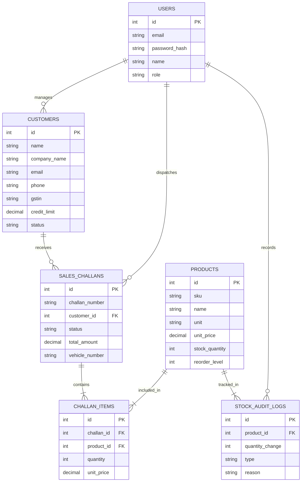

# NexusERP & CRM Operations Portal 🚀

A production-grade, enterprise Mini ERP and CRM system designed for wholesale and distribution enterprises. Built with a full-stack Node.js + TypeScript + Express + PostgreSQL backend and a Vite + React + TypeScript dark-glassmorphic UI.

---

## 🌟 Key Highlights & Business Capabilities

1. **Integrated Customer Relationship Management (CRM)**
   - Lead pipeline tracking, customer profiles, contact management, GSTIN verification, and credit limit allocations.
   - Real-time customer activity metrics and assigned sales representative metadata.

2. **Inventory & Warehouse Stock Control**
   - Item master catalogue with SKU tracking, unit pricing, tax rates (GST/VAT), and reorder thresholds.
   - Atomic inventory movements with full stock audit logs (`INBOUND`, `OUTBOUND_CHALLAN`, `ADJUSTMENT`, `RETURN`).
   - Dynamic alert indicators for low-stock products nearing critical reorder thresholds.

3. **Sales Challan & Dispatch Logistics**
   - Automated delivery challan generation with transport vehicle details and delivery notes.
   - **Transaction-Safe Stock Reservation**: When a delivery sales challan is dispatched, the database executes atomic row locking (`SELECT ... FOR UPDATE`) inside a PostgreSQL SQL transaction block, auto-deducting product stock and raising inventory audit entries without risk of race conditions or negative inventory.

4. **Executive Dashboard & Real-Time Metrics**
   - High-level KPIs: Active Accounts, Revenue Metrics, Pending Dispatches, Low Stock Alerts.
   - Tabbed navigation across Overview, CRM Accounts, Stock Master, Sales Challans, and System Audit Logs.

---

## 🛠️ Technology Stack

### Backend Architecture
- **Runtime**: Node.js v20+ with ES Modules
- **Framework**: Express.js with TypeScript
- **Database**: PostgreSQL with `pg` connection pool
- **Validation**: Zod schema validation for strict request payloads
- **Security**: JWT (JSON Web Tokens), `bcryptjs` hashing, CORS, `helmet` security headers
- **Architecture**: Layered Modular Pattern (`routes` -> `controller` -> `service` -> `repository/db`)

### Frontend Architecture
- **Core**: React 18 + TypeScript + Vite
- **Icons**: Lucide React icons
- **Styling**: Premium Custom Vanilla CSS Design System with dynamic Dark Glassmorphism, animated subtle glows, micro-interactions, responsive CSS grid/flexbox layouts.

---

## 📊 Database ER Schema & Architecture



---

## 🚀 Quickstart & Local Setup Guide

### Prerequisites
- Node.js (v18 or higher)
- PostgreSQL (v14 or higher running locally or accessible remotely)

### 1. Database Setup
Ensure PostgreSQL service is running and create the `nexuserp` database:
```sql
CREATE DATABASE nexuserp;
```

### 2. Backend Setup
```bash
cd backend

# Install dependencies
npm install

# Create environment file
cp .env.example .env

# Edit .env with your PostgreSQL credentials:
# DB_HOST=localhost
# DB_PORT=5432
# DB_USER=postgres
# DB_PASSWORD=your_password
# DB_NAME=nexuserp
# PORT=5000
# JWT_SECRET=nexus_super_secret_jwt_key_2026

# Initialize Schema & Seed Demo Data
npm run db:setup

# Build TypeScript code
npm run build

# Start Production Backend Server
npm start
```
*Backend server will start listening at `http://localhost:5000`.*

### 3. Frontend Setup
```bash
cd frontend

# Install dependencies
npm install

# Build production distribution bundle
npm run build

# Start local preview server (or dev server)
npm run dev
```
*Frontend app will run at `http://localhost:5173`.*

---

## 🔐 Default Demo Credentials

| Role | Email | Password | Access Level |
| :--- | :--- | :--- | :--- |
| **System Administrator** | `admin@nexuserp.com` | `admin123` | Full ERP & CRM Access |
| **Sales Representative** | `sales@nexuserp.com` | `sales123` | Customer CRM & Sales Dispatches |

---

## 🌐 AWS Cloud Deployment Guide (EC2 + RDS + Nginx + PM2)

### 1. Database Setup (AWS RDS PostgreSQL)
1. Launch an AWS RDS PostgreSQL instance in your target VPC.
2. Note the RDS Endpoint DNS URL.
3. Configure Security Group rules to allow port `5432` access from your EC2 instance security group.

### 2. Server Provisioning (AWS EC2 Ubuntu 24.04 LTS)
1. Launch an EC2 `t3.medium` instance.
2. Attach an Elastic IP address.
3. SSH into the server:
   ```bash
   ssh -i keypair.pem ubuntu@<YOUR-EC2-PUBLIC-IP>
   ```

### 3. Software Dependencies Installation
```bash
sudo apt update && sudo apt upgrade -y
curl -fsSL https://deb.nodesource.com/setup_20.x | sudo -E bash -
sudo apt install -y nodejs nginx git certbot python3-certbot-nginx
sudo npm install -g pm2
```

### 4. Code Base Deployment & Build
```bash
# Clone Repository
git clone https://github.com/your-org/nexuserp.git /var/www/nexuserp
cd /var/www/nexuserp

# Setup & Build Backend
cd backend
npm install
cp .env.example .env
# Edit .env with RDS Endpoint host & credentials
nano .env
npm run db:setup
npm run build

# Start Backend Daemon using PM2
pm2 start dist/server.js --name "nexuserp-backend"
pm2 save
pm2 startup

# Setup & Build Frontend
cd ../frontend
npm install
# Configure Vite API base URL if using remote domain
npm run build
```

### 5. Nginx Reverse Proxy Configuration
Create `/etc/nginx/sites-available/nexuserp`:
```nginx
server {
    listen 80;
    server_name erp.yourdomain.com;

    # Serve React Static Production Frontend
    location / {
        root /var/www/nexuserp/frontend/dist;
        index index.html;
        try_files $uri $uri/ /index.html;
    }

    # Proxy REST API requests to Express backend on port 5000
    location /api/ {
        proxy_pass http://127.0.0.1:5000;
        proxy_http_version 1.1;
        proxy_set_header Upgrade $http_upgrade;
        proxy_set_header Connection 'upgrade';
        proxy_set_header Host $host;
        proxy_cache_bypass $http_upgrade;
        proxy_set_header X-Real-IP $remote_addr;
        proxy_set_header X-Forwarded-For $proxy_add_x_forwarded_for;
    }
}
```

Enable Nginx site configuration & verify syntax:
```bash
sudo ln -s /etc/nginx/sites-available/nexuserp /etc/nginx/sites-enabled/
sudo nginx -t
sudo systemctl restart nginx
```

### 6. SSL Security Setup (HTTPS via Let's Encrypt)
```bash
sudo certbot --nginx -d erp.yourdomain.com
```

---

## 📑 Postman API Collection

A pre-configured Postman Collection file `NexusERP.postman_collection.json` is included at the project root.

### Features in Postman Collection:
- Automated JWT Authorization environment variable extraction after calling `/api/v1/auth/login`.
- Endpoints included:
  - `POST /api/v1/auth/login`
  - `GET /api/v1/auth/me`
  - `GET /api/v1/customers`
  - `POST /api/v1/customers`
  - `GET /api/v1/customers/:id`
  - `PUT /api/v1/customers/:id`
  - `GET /api/v1/products`
  - `POST /api/v1/products`
  - `PATCH /api/v1/products/:id/stock`
  - `GET /api/v1/challans`
  - `POST /api/v1/challans`
  - `PATCH /api/v1/challans/:id/status`

To import into Postman: Open Postman -> Click **Import** -> Select `NexusERP.postman_collection.json`.

---

## 📄 License
Designed & Developed for Full Stack ERP/CRM Operations Case Study.
